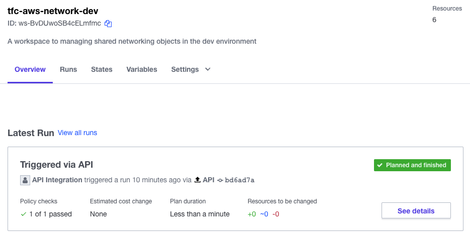

# doormat-cli-automation
This repo contains any wrappers I use around `doormat` and `tecli`. If you dont already know what doormat-cli is, then this repo is of no use to you.

## Prerequisites
- doormat-cli
- [tecli](https://github.com/awslabs/tecli)
- jq

## Required env args
| Env | Description |
| --- | ----------- |
| TFC_ORGANIZATION_TOKEN | Your Terraform Cloud organization token |
| TFC_ORGANIZATION | Your Terraform Cloud organization |
| DOORMAT_ACCOUNT | Name of the doormat account to use |

## Workflow
1. Check we have valid doormat credentials, if not, renew.
2. Push credentials to workspace
3. Start run in workspace


## Example usage with no valid credentials
```bash
sh demo.sh aws
20220509-094543 INFO: Checking if the TFC_ORGANIZATION_TOKEN environment variable has been set.
20220509-094543 INFO: TFC_ORGANIZATION_TOKEN environment variable was found.
20220509-094543 INFO: Checking if the TFC_ORGANIZATION environment variable has been set.
20220509-094543 INFO: TFC_ORGANIZATION environment variable was found.
20220509-094543 INFO: Checking if the DOORMAT_ACCOUNT environment variable has been set.
20220509-094543 INFO: DOORMAT_ACCOUNT environment variable was found.
FATA[0002] unexpected HTTP status 401 UNAUTHORIZED, want 200
20220509-091645 INFO: Refreshing doormat credentials
ERRO[0001] New Doormat CLI recommended: v3.1.2
==> Refreshing Doormat Credentials
==> Successfully refreshed Doormat credentials!
20220509-094545 INFO: Starting AWS demos
20220509-094545 INFO: Pushing AWS credential to tfc-aws-network-dev
INFO[0001] Getting Creds for TFC/TFE
INFO[0007] Creds pushed to "tfc-aws-network-dev"
INFO[0007] Done
20220509-094552 INFO: Starting run for workspace tfc-aws-network-dev
20220509-094557 INFO: Pushing AWS credential to tfc-aws-network-prod
INFO[0001] Getting Creds for TFC/TFE
INFO[0007] Creds pushed to "tfc-aws-network-prod"
INFO[0007] Done
20220509-094605 INFO: Starting run for workspace tfc-aws-network-prod
```

## Example usage with valid credentials
```bash
sh demo.sh aws
20220509-094543 INFO: Checking if the TFC_ORGANIZATION_TOKEN environment variable has been set.
20220509-094543 INFO: TFC_ORGANIZATION_TOKEN environment variable was found.
20220509-094543 INFO: Checking if the TFC_ORGANIZATION environment variable has been set.
20220509-094543 INFO: TFC_ORGANIZATION environment variable was found.
20220509-094543 INFO: Checking if the DOORMAT_ACCOUNT environment variable has been set.
20220509-094543 INFO: DOORMAT_ACCOUNT environment variable was found.
20220509-094545 INFO: Doormat credentials valid
20220509-094545 INFO: Starting AWS demos
20220509-094545 INFO: Pushing AWS credential to tfc-aws-network-dev
INFO[0001] Getting Creds for TFC/TFE
INFO[0007] Creds pushed to "tfc-aws-network-dev"
INFO[0007] Done
20220509-094552 INFO: Starting run for workspace tfc-aws-network-dev
20220509-094557 INFO: Pushing AWS credential to tfc-aws-network-prod
INFO[0001] Getting Creds for TFC/TFE
INFO[0007] Creds pushed to "tfc-aws-network-prod"
INFO[0007] Done
20220509-094605 INFO: Starting run for workspace tfc-aws-network-prod
```

## Outcome



## Todo
- Use positional args in workspace query (see commented function)
